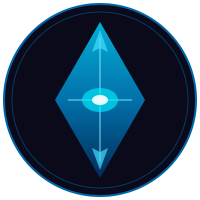

<p align="center">
  
</p>

<h1 align="center">Hierarch</h1>

<p align="center">
  <em>StarCraft II Protoss voice lines as Claude Code hook notifications.</em>
  <br />
  <strong>You must construct additional prompts.</strong>
</p>

<p align="center">
  
  
  
  
</p>

---

Hear Protoss units react to your Claude Code workflow. A Zealot acknowledges your prompt. A Carrier announces task completion. An Immortal greets you when a session starts. A Probe chirps happily throughout.

## How It Works

[Claude Code hooks](https://docs.anthropic.com/en/docs/claude-code/hooks) fire shell commands on lifecycle events. This project plays a random Protoss sound clip on each event:

| Event | When | What You Hear |
|-------|------|---------------|
| **SessionStart** | Claude session begins | *"Carrier has arrived!"* / *"Prismatic core online."* |
| **UserPromptSubmit** | You send a prompt | *"It shall be done."* / *"By your will!"* |
| **Stop** | Claude finishes responding | *"The battle is won."* / *"Command me."* |
| **PreCompact** | Context memory compressed | *"We cannot hold!"* / *"An omen?"* |

## Two Modes

- **`probe`** -- Just Probe chirps. Subtle, non-distracting beeps and boops.
- **`all`** -- Full SC2 multiplayer Protoss roster. 9 units, 80 voice lines.

## Units

| Unit | SessionStart | Prompt | Stop | PreCompact |
|------|:---:|:---:|:---:|:---:|
| **Probe** | Trained chirps | Selected / Confirm | Confirm chirps | Death / Annoyed |
| **Zealot** | "My life for Aiur!" | "By your will!" | "Command me." | "We cannot hold!" |
| **Stalker** | "I am here in the shadows." | "It shall be as you say." | -- | "Cold is the Void..." |
| **Dark Templar** | "From the shadows I come!" | "I will comply." | "I bask in the twilight." | "Fear is an illusion..." |
| **Adept** | -- | "It shall be done." | -- | -- |
| **Immortal** | "I return to serve." | "It is destined." | "Glory is eternal." | "The enemy closes." |
| **Carrier** | "Carrier has arrived!" | "Let us proceed." | "The battle is won." | "We are in peril!" |
| **Void Ray** | "Prismatic core online." | "Calibrating void lenses." | "Systems at full." | "Channel the light of Aiur!" |
| **Oracle** | "Oracle perceiving." | "Let us begin." | "The threads of fate lie bare." | "An omen?" |

> SC2 multiplayer units only. No SC1, campaign, or co-op units.

## Install

### Prerequisites

```bash
# Linux / WSL
sudo apt install mpv            # Required for all modes
sudo apt install ffmpeg curl    # Only if you choose local playback

# macOS
brew install mpv
brew install ffmpeg curl        # Only if you choose local playback
```

### Setup

```bash
git clone https://github.com/PatrickSmiley/hierarch.git
cd hierarch
bash install.sh
```

The installer prompts you for two choices:

**Playback mode:**
- **Stream** (default) -- Sounds play directly from the [StarCraft Wiki](https://starcraft.fandom.com/wiki/StarCraft_II_unit_quotations/Protoss). No downloads, no local storage. Requires internet.
- **Local** -- Downloads ~80 sounds and converts to mp3. Works offline. Requires `ffmpeg` and `curl`.

**Hook scope** (per [Claude Code docs](https://code.claude.com/docs/en/hooks#hook-locations)):
- **Global** (default) -- Writes to `~/.claude/settings.json`. Sounds play in every Claude Code session.
- **Project** -- Writes to `.claude/settings.json`. Sounds only play in this project. Committable to share with a team.
- **Project-local** -- Writes to `.claude/settings.local.json`. Same as project but gitignored.

Restart Claude Code. You should hear a Protoss unit greet you.

### Switch Modes

```bash
~/.claude/sc2-toggle.sh probe   # Probe chirps only
~/.claude/sc2-toggle.sh all     # Full Protoss roster
~/.claude/sc2-toggle.sh         # Toggle between them
```

### Adjust Volume

```bash
~/.claude/sc2-toggle.sh volume 50    # Set to 50%
~/.claude/sc2-toggle.sh volume 30    # Quieter
~/.claude/sc2-toggle.sh volume       # Show current volume
```

Volume is stored in `~/.claude/sc2-volume` (default: 50%). Range: 0-100.

## Preview Sounds

Open `preview.html` in a browser to audition every sound organized by hook event. Click any card to play. Toggle between Probe-only and All Units views.

## File Structure

```
hierarch/                    # Keep this repo cloned
├── sounds/
│   ├── probe/*.txt          # URL manifests for probe mode (streaming)
│   └── all/*.txt            # URL manifests for all-units mode (streaming)
├── play-sc2.sh              # Player script (copied to ~/.claude/)
├── sc2-toggle.sh            # Mode toggle (copied to ~/.claude/)
├── download-sounds.sh       # Sound downloader (local playback only)
├── install.sh               # Interactive installer
└── preview.html             # Sound audition page

~/.claude/
├── settings.json            # Hook config (or .claude/settings.json for project scope)
├── play-sc2.sh              # Auto-detects local mp3s, falls back to streaming
├── sc2-toggle.sh            # Switches between probe/all
├── sc2-mode                 # Current mode ("probe" or "all")
├── sc2-hierarch-path        # Points to your cloned repo (for streaming)
└── sounds/                  # Local mp3 files (only if downloaded)
```

## Requirements

- [Claude Code](https://code.claude.com) CLI
- `mpv` -- streams and plays audio
- `ffmpeg` + `curl` -- only needed for local playback mode
- Linux, WSL, or macOS

## Credits & Acknowledgments

This project was inspired by and builds upon the work of others:

- **[Boris Cherny](https://x.com/bcherny)** ([@bcherny](https://github.com/bcherny)) -- Creator of [Claude Code](https://code.claude.com). The [hooks system](https://code.claude.com/docs/en/hooks) he built is what makes this project possible.

- **[starcraft-claude](https://github.com/rubenflamshepherd/starcraft-claude)** by [@rubenflamshepherd](https://github.com/rubenflamshepherd) -- The original StarCraft sound hooks project for Claude Code. Provides a full Node.js web UI for browsing, previewing, and downloading sounds across all three races (Protoss, Terran, Zerg). This project wouldn't exist without it.

- **[Delba Oliveira](https://x.com/delba_oliveira)** ([@delba_oliveira](https://x.com/delba_oliveira)) -- Staff Developer Advocate at Vercel, whose [post about Claude Code hooks](https://x.com/delba_oliveira/status/2020515010985005255) kicked off the idea.

- **[StarCraft Wiki](https://starcraft.fandom.com/wiki/StarCraft_II_unit_quotations/Protoss)** on Fandom -- Community-maintained wiki where all unit quotation audio files are hosted. Sounds are streamed directly from this wiki at runtime.


## Legal

### This Repository (Scripts & Configuration)

MIT License. See [LICENSE](LICENSE) for full text.

### StarCraft II Audio Content

**All StarCraft II audio, voice lines, character names, unit names, and related game assets are the intellectual property of Blizzard Entertainment, Inc., a subsidiary of Activision Blizzard King (Microsoft).**

- StarCraft, StarCraft II, Protoss, and all related names, logos, and imagery are **trademarks or registered trademarks** of Blizzard Entertainment, Inc.
- This repository contains **no audio files**. Sound clips are streamed at runtime directly from the [StarCraft Wiki on Fandom](https://starcraft.fandom.com/).
- Audio files on the StarCraft Wiki are community-uploaded game extracts hosted on Fandom's infrastructure under their [Terms of Use](https://www.fandom.com/terms-of-use) and [Licensing Policy](https://www.fandom.com/licensing).
- Use of StarCraft II game content may be subject to Blizzard's [End User License Agreement](https://www.blizzard.com/en-us/legal/fba4d00f-c7e4-4883-b8b9-1b4500a402ea/blizzard-end-user-license-agreement).

**This is an unofficial fan project for personal use. It is not affiliated with, endorsed by, or sponsored by Blizzard Entertainment, Activision Blizzard, Microsoft, or Fandom.**

---

<p align="center">
  <em>My life for Aiur.</em>
</p>
